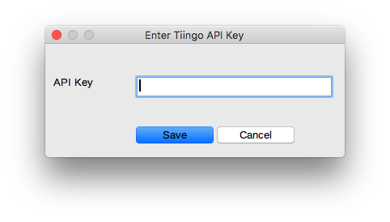

# Qalydon Finance LibreOffice Calc Extension
Copyright © 2018, 2019 by Dave Hocker as Qalydon

## Contents
* [Overview](#overview)
* [Installation](#installation)
* [Configuration File](#configuration-file)
* [Data sources](#data-sources)
* [Using LoCalc Functions](#using-localc-functions)
* [LoCalc Functions](#extension-localc-functions)
* [References](#references)

## Overview
This project implements a LibreOffice Calc (LOCalc) addin extension that can
retrieve stock market data from various free sources. Currently, most of the 
available data is historical. This is a good extension for getting
historical OHLC data. 

There is no support for anything real-time or quasi-real-time.

The intent here is to provide a set of abstract functions that are independent
of the underlying data source(s). Previous LOCalc extensions I have written
are dependent on a specific data source (e.g. Intrinio or IEX). When
The data sources change, the extension functions are frequently impacted
and thus, any using spreadsheet is impacted. Some of the extension
functions are actually modeled on the data source's API.
And, worse yet, the T's and C's of the data source can change making 
the data no longer freely available.

An example will serve to illustrate this point about abstraction. 
The first function to 
be implemented in this extension was QFClosingPrice. That function can
be implemented using any data source that can provide a ticker symbols's 
closing price for a given date. There's nothing in the function name 
or its parameters (a ticker symbol, category and date) that indicates
the actual source. If the initial implementation of QFClosingPrice
uses data source A and this source subsequently changes, the implementation of 
QFClosingPrice can be changed to use data source B without changing 
any using spreadsheet. Of course this depends on both data sources
A and B supporting a historical closing price.

The abstraction concept is implemented using a data source list for 
each category of ticker symbol. The list specifies which data sources
can obtain data for a category. If the first data source in the list fails 
to return data, the second data source is tried. Each data source in
a list is tried until data is returned or the list is exhausted.

### LibreOffice Compatibility
The LOCalc addin works on the Windows, macOS and Ubuntu versions of
[LibreOffice (version >= 5.0)](https://www.libreoffice.org/).
Testing is performed on the latest general distribution release.

### License
GNU GENERAL PUBLIC LICENSE Version 3, 29 June 2007. Refer to the
[LICENSE.md](https://github.com/qalydon/qf-localc/blob/master/README.md)
file for complete details.

## Attribution
Some data provided for free by [IEX](https://iextrading.com/developer).
Some data [Powered by IEX Cloud](https://iexcloud.io).

By using the IEX data source, you agree to the
[IEX terms of service](https://iextrading.com/api-exhibit-a) and
[IEX Cloud terms of service](https://iexcloud.io/terms/).

## Download
Download the latest **qf.oxt** (the add-in file) from
[here](https://github.com/qalydon/qf-localc/releases).

## Installation
1. Download the latest **qf.oxt** (the add-in file) from
[here](https://github.com/qalydon/qf-localc/releases).
1. Start LibreOffice or LibreOffice Calc.
1. From the Tools menu, open the Extension Manager.
1. Look through the list of installed add-ins for QFinance.
If you find it, click the Remove button to remove it.
For best results, **remove an existing QFinance
add-in first**.
1. Click the Add button.
1. Navigate to the location where you downloaded **qf.oxt**.
Select it.
1. Choose if you want the add-in installed for you or everyone.
1. Click the Close button.
1. If LibreOffice asks to restart, do so.

**It is recommended that you always remove an existing version of the
add-in before installing an update. Othwerwise, your results may be
unpredictable.**

## Configuration File
The extension can be customized using its configuration file. You do not have to 
create a configuration file. The extension will create a default configuration file
the first time it is used within LibreOffice.

The content of the configuration file is JSON and looks something like this (showing defaults).
```json
{
  "loglevel": "debug",
  "cachedb": "~/libreoffice/qf/qf-cache-db.sqlite3",
  "datasources":
  {
    "comment": "List of data sources in priority order",
    "stock": ["tiingo", "stooq", "wsj", "iex", "yahoo"],
    "mutf": ["wsj", "tiingo", "stooq", "iex", "yahoo"],
    "etf": ["tiingo", "wsj", "stooq", "iex", "yahoo"],
    "index": ["stooq", "wsj", "yahoo"],
    "dividend": ["iex"]
  },
  "stooqconf": 
  {
        "tickerpostfix": ".us"
  },
  "tiingoconf":
  {
    "apitoken": "0123456789012345678901234567890123456789"
  },
  "yahooconf":
  {
    "pacing": "0.200"
  }
}
```

| Key | Value |
|:-----|:-------|
| loglevel | error, warning, info, debug (default) |
| cachedb | Historical data is persistently cached in a SQLite database. This tells the extension what database to create and use.
| datasources | The extension can use several sources for each ticker symbol category data. See the [list](#data-sources) below.
| stooqconf | Specific configuration for the Stooq data source. See [below](#using-stooq). | 
| tiingoconf | Specific configuration for the Tiingo data source. See [below](#using-tiingo). |
| yahooconf | Specific configuration fot the Yahoo data source. See [below](#yahoo).

The location of the configuration file depends on your operating system.

| OS | Location |
|:----|:----------|
| Windows | C:\Users\username\AppData\Local\libreoffice\qf\qf.conf |
| macOS | /Users/username/libreoffice/qf/qf.conf |
| Ubuntu | /home/username/libreoffice/qf/qf.conf |

### Configuration File Permissions
Finally, it is recommended that you set the permissions on the configuration file
so that only your user account has any access to the file. Your account should
have read/write access by all other accounts should have NO access.

### Data Sources
The configuration file specifies a list of data sources for each category of
ticker symbol: stock, mutf, etf, index. The following datasources are recognized.

| datasource | Description |
| :----      | :---        |
| wsj        | Wall Street Journal web site (default) |
| iex        | IEX Version 1.0 API from Inverstor's Exchange trading web service |
| stooq      | stooq.com web site |
| tiingo     | See [Tiingo API](https://www.tiingo.com/data/api). <br/>Requires a free basic account or better. |
| yahoo      | Yahoo financial web site |

A word about data sources. 

The listed data sources are free. However, they reserve the right
to limit your use of their service. Therefore, your mileage may vary. Each of these
data sources tend to have their own idiosyncrasies.

Also, each data source **does not** support every kind of ticker symbol 
(stock, mutual fund, ETF, index). The WSJ and Yahoo data sources seem to be the most comprehensive 
while the other sources typically only support stocks and ETFs (e.g. IEX and Stooq).

In the future, other data sources may be added.

#### Using Stooq
If you want to use Stooq as your data source, you need to be aware of the ticker
symbols that it recognizes. By observation, most ticker symbols need to have ".us"
appended to the normal symbol. For example, the symbol "ibm" would be
"ibm.us".

Since you don't want to change all of the ticker symbols in a spreadsheet when
you change the data source, the postfix is applied by the extension. The postfix 
defaults to ".us", but should you need a different postfix you can define one
in the configuration file.

```json
{
  "loglevel": "debug",
  "cachedb": "~/libreoffice/qf/qf-cache-db.sqlite3",
  "datasources":
  {
    "comment": "List data sources in priority order",
    "stock": ["tiingo", "stooq", "wsj", "iex", "yahoo"],
    "mutf": ["wsj", "tiingo", "stooq", "iex", "yahoo"],
    "etf": ["tiingo", "wsj", "stooq", "iex", "yahoo"],
    "index": ["stooq", "wsj", "yahoo"]
  },
  "stooqconf":
  {
    "tickerpostfix": ".us"
  }
}
```

#### Using Tiingo
If you want to use Tiingo as a data source, you need to create an account
and get your API token. Go to [https://www.tiingo.com/](https://www.tiingo.com/)
and click on the Sign-up button. After you get through the sign-up procedure
you can get your API token. You should be able to get your API token from
this page [Connecting](https://api.tiingo.com/documentation/general/connecting).
Copy your API token and paste it into your configuration file as shown below.

Be sure to note the [limitations](https://api.tiingo.com/about/pricing) of a free account.

```json
{
  "loglevel": "debug",
  "cachedb": "~/libreoffice/qf/qf-cache-db.sqlite3",
  "datasources":
  {
    "comment": "List data sources in priority order",
    "stock": ["tiingo", "stooq", "wsj", "iex", "yahoo"],
    "mutf": ["wsj", "tiingo", "stooq", "iex", "yahoo"],
    "etf": ["tiingo", "wsj", "stooq", "iex", "yahoo"],
    "index": ["stooq", "wsj", "yahoo"]
  },
  "tiingoconf":
  {
    "apitoken": "0123456789012345678901234567890123456789"
  }
}
```

If you do not configure an API key, you will be prompted to enter an API key
on the first attempt to use Tiingo. Whatever you enter will be saved as the
API key.



When using Tiingo, it is vitally important that you should set the permissions 
of the configuration file as described [above](#configuration-file-permissions).

#### Yahoo
The Yahoo data source seems to support all ticker symbol categories. However, 
it is implemented using a technique that is known as web page "screen scraping".
Screen scraping is subject to breakage if/when the web page changes.

It is unclear how or if Yahoo throttles requests. If you find that Yahoo is
throttling your requests, use the Yahoo configuration section to specify a pacing value.
The default setting is 0.200 seconds (200 ms). You might be able to run with a
smaller pacing value, but anything below 0.100 is NOT recommended.

```json
{
  "loglevel": "debug",
  "cachedb": "~/libreoffice/qf/qf-cache-db.sqlite3",
  "datasources":
  {
    "comment": "List data sources in priority order",
    "stock": ["tiingo", "stooq", "wsj", "iex", "yahoo"],
    "mutf": ["wsj", "tiingo", "stooq", "iex", "yahoo"],
    "etf": ["tiingo", "wsj", "stooq", "iex", "yahoo"],
    "index": ["stooq", "wsj", "yahoo"]
  },
  "yahooconf":
  {
    "pacing": 0.200
  }
}
```

#### IEX 1.0
The IEX Version 1.0 API offers a large amount of data. In addition to 
historical stock prices, it offers
historical dividend information. Unfortunately, the data is only good up to
March 2018. As of that date, IEX stopped updating dividend information in favor
of moving users to its new [IEX Cloud API](https://iexcloud.io).

#### Forcing a Specific Data Source
If for some reason you want to force a category to use a spceific data source,
remove all but the desired data source from the category list.

For example, this will limit stock category requests to Tiingo.

```json
{
  "loglevel": "debug",
  "cachedb": "~/libreoffice/qf/qf-cache-db.sqlite3",
  "datasources":
  {
    "comment": "List data sources in priority order",
    "stock": ["tiingo"],
    "mutf": ["wsj", "tiingo", "stooq", "iex"],
    "etf": ["tiingo", "wsj", "stooq", "iex"],
    "index": ["stooq", "wsj"]
  },
  "tiingoconf":
  {
    "apitoken": "0123456789012345678901234567890123456789"
  }
}
```

#### Changing Data Source Priority
You can change the priority of data sources by simply reordering the list
and placing the highest priority source at the beginning. Data sources are
tried in the order they appear in a category list.

## Example Files
You can find a number of example files in the
[examples folder](https://github.com/qalydon/qf-localc/tree/master/examples).
These files show you how most of the LOCalc Extension functions
can be used.

## Using LOCalc Functions

### Ticker Symbol Categories
Most LOCalc functions that use ticker symbols also require a category.
The category is necessary
because some sources require it as a ticker symbol qualifier and it is 
difficult to determine a symbol's category from its ticker symbol.

The standard categories are:
* stock or empty (as in the empty string "")
* mutf or mututalfund
* etf
* index

Some examples:
```
=QFClosingPrice("ibm", "stock", "2018-12-07")
=QFClosingPrice("ibm", "", "2018-12-07")
=QFClosingPrice("usibx", "mutf", "2018-12-07")
=QFClosingPrice("vym", "etf", "2018-12-07")
=QFClosingPrice("djia", "index", "2018-12-07")
```

### Standardized Index Names
Those data sources that support indexes tend to recognize different 
index names. To ameliorate this problem, each data source translates
a standard index name to a data source specific index name.

Standard index names are
* djia - Dow Jones Industrial Average
* spx - S&P 500
* nasdaq - NASDAQ Composite

Some examples:
```
=QFClosingPrice("djia", "index", "2018-12-07")
=QFClosingPrice("spx", "index", "2018-12-07")
=QFClosingPrice("nasdaq", "index", "2018-12-07")
```

## Extension LOCalc Functions

### Historical Market Data
The extension provides a number of functions for retrieving historical market data.

* Opening price
* Closing price
* High price of day
* Low price of day
* Day volume

### QFClosingPrice
Returns the closing price for a ticker symbol on a given date.
```
=QFClosingPrice(symbol, category, date)
```

symbol: The ticker symbol for the equity whose closing price is to be retrieved.

category: stock, mutf or mututalfund, etf, index. 

date: The date for the closing price in ISO format (YYYY-MM-DD)

### QFOpeningPrice
Returns the opening price for a ticker symbol on a given date.
```
=QFOpeningPrice(symbol, category, date)
```

symbol: The ticker symbol for the equity whose opening price is to be retrieved.

category: stock, mutf or mututalfund, etf, index. 

date: The date for the opening price in ISO format (YYYY-MM-DD)

### QFHighPrice
Returns the high price for a ticker symbol on a given date.
```
=QFHighPrice(symbol, category, date)
```

symbol: The ticker symbol for the equity whose price is to be retrieved.

category: stock, mutf or mututalfund, etf, index.  

date: The date for the price in ISO format (YYYY-MM-DD)

### QFLowPrice
Returns the low price for a ticker symbol on a given date.
```
=QFLowPrice(symbol, category, date)
```

symbol: The ticker symbol for the equity whose price is to be retrieved.

category: stock, mutf or mututalfund, etf, index. The category is necessary
because some sources require it as a ticker symbol qualifier and it is 
difficult to determine a symbol's category from its ticker symbol. 

date: The date for the price in ISO format (YYYY-MM-DD)

### QFVolume
Returns the day volume for a ticker symbol on a given date.
```
=QFVolume(symbol, category, date)
```

symbol: The ticker symbol for the equity whose day volume is to be retrieved.

category: stock, mutf or mututalfund, etf, index.

date: The date for the dat volume in ISO format (YYYY-MM-DD)

### QFTTMDividend
Returns the trailing 12 month dividend for a ticker symbol.
The 12 month period is the 12 months preceding the given date.
```
=QFTTMDividend(symbol, date)
```

symbol: The ticker symbol for the equity whose dividend is to be retrieved.

date: The ending date for the 12 month period, in ISO format (YYYY-MM-DD)

## Utility Functions

### QFVersion
Returns the version of the QFinance extension.
```
=QFVersion()
```

### QFDataSource
Returns the current data source. See [above](#data-sources) for a list
of supported data sources.
```
=QFDataSource()
```

## References
* [LibreOffice Web Site](https://www.libreoffice.org/)